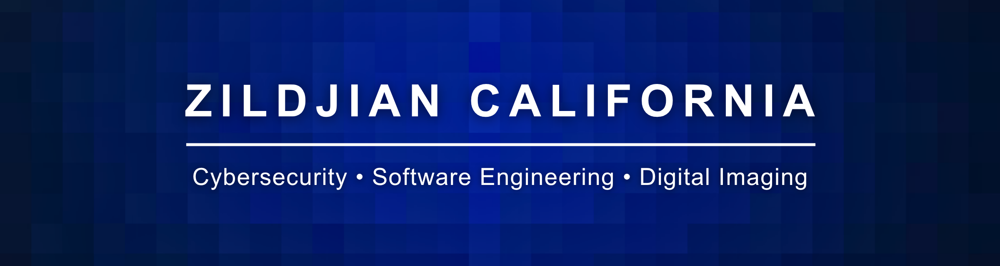

  

  <a href="https://github.com/zcalifornia-ph">github</a> |
  <a href="https://zecalifornia.com">website</a> |
  <a href="https://dev.to/zcalifornia">dev.to</a> |
  <a href="https://linkedin.com/in/zcalifornia">linkedin</a> |
  <a href="https://orcid.org/0009-0002-2357-7606">orcid</a> |
  <a href="mailto:zecalifornia@up.edu.ph">email</a>

# 👋 Zildjian California

I build toward the intersection of **algorithms**, **digital imaging**, **cybersecurity**, and **computing for civic systems**.

📍 Philippines 🇵🇭 
🎓 **BS Computer Science** student at the **University of the Philippines - Mindanao (CSM-DMPCS)**

**Most recent:** ["Studying the Dangerous Responsibly"](https://dev.to/zcalifornia/studying-the-dangerous-responsibly-ai-assisted-exploit-documentation-as-ethical-practice-2ccd) — an ethics-first analysis of CVE-2026-33825, published April 2026.

## 💫 About Me

I'm interested in both **research** and **applied work** around:

- **Algorithms & problem-solving**
- **Computer Graphics & Digital Imaging**, especially imaging pipelines
- **Cybersecurity**
- **Tech and public policy**, especially how computing shapes civic and institutional systems

## 🎯 Current Direction

- 🔭 **Currently building:** a stronger public portfolio around imaging, graphics, security, and systems-oriented CS
- 🌱 **Currently learning:** deeper imaging pipelines, secure software habits, and applied software engineering
- 🤝 **Open to:** collaborations, mentoring, and research discussions
- 💬 **Ask me about:** imaging pipelines, interdisciplinary computing, CS learning, and tech + public policy

## 🚀 Current Focus & Featured Work

### Featured Work

- [bluehammer-analysis](https://github.com/zcalifornia-ph/bluehammer-analysis) - Ethics-first archival study of CVE-2026-33825 (BlueHammer). Paired writeup: [Studying the Dangerous Responsibly](https://dev.to/zcalifornia/studying-the-dangerous-responsibly-ai-assisted-exploit-documentation-as-ethical-practice-2ccd).
- [cardiff](https://github.com/zcalifornia-ph/cardiff) - Python/FastAPI document-generation system with a contract-first rendering core.
- [beamer-up](https://github.com/zcalifornia-ph/beamer-up) - Unofficial UP System Beamer theme for thesis defenses, class reports, and research talks.
- [aes256-java](https://github.com/zcalifornia-ph/aes256-java) - Educational AES-256-GCM toolkit in Java.

### Writing / Research Direction

- Computing for civic and institutional systems
- Interdisciplinary software work that connects technical depth with public impact

## 💻 Tech Stack

             

## 📊 GitHub Stats

  
  

